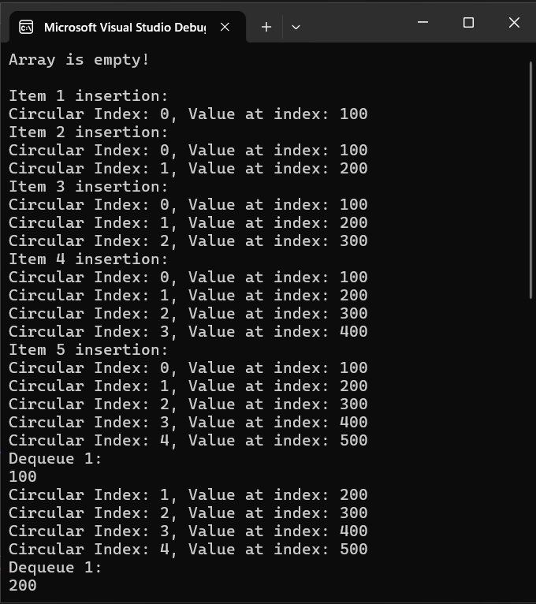

# To Circular Arrays, With Love

During my Data Structures course, the professor offered a chance to get extra credit by writing a paper on circular arrays.

It involved writing a detailed report and also providing code in C to demonstrate how they function.

I was very happy with how this report turned out, and very pleased that I was able to code this from scratch. 
This paper not only provided me greater insight about this data structure, but my teacher also gave me a mark of 125%.

I just hope that maybe someone will find this one day, and find it as useful as I did when learning about this data structure.

Please feel free to use this code for any reason!

